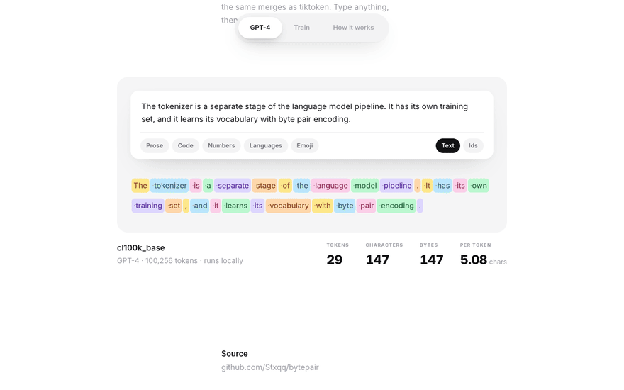
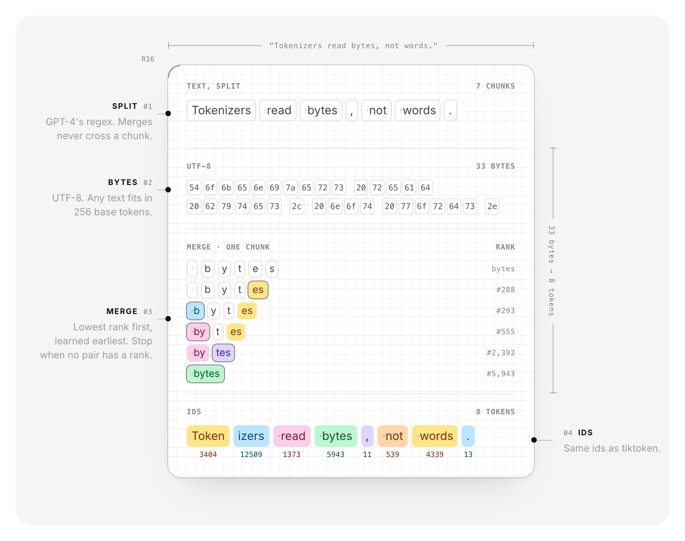
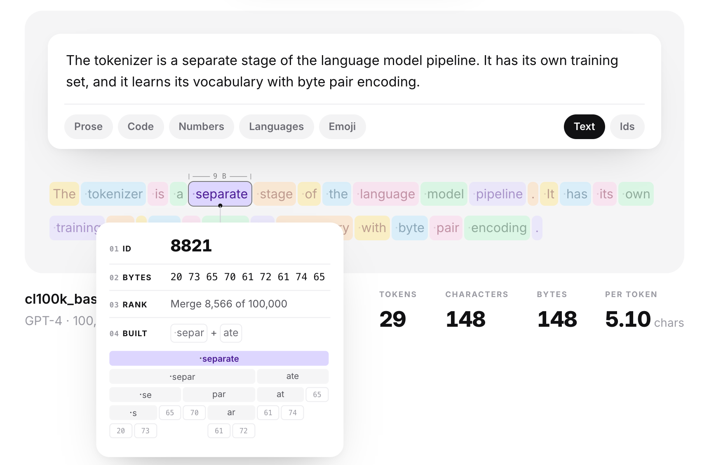
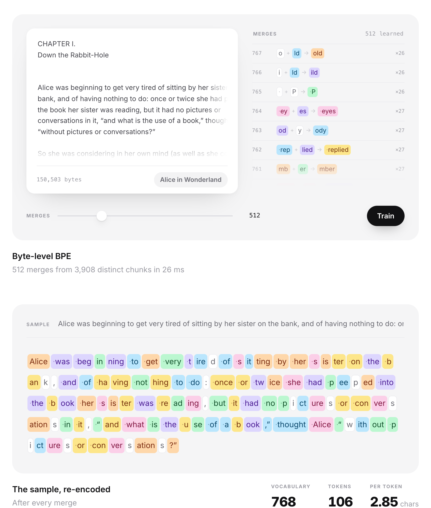

# bytepair

A byte-level BPE tokenizer in plain Python, under 1,000 lines, that reproduces GPT-4's `cl100k_base` ids exactly.

<p align="center">
  
</p>

<p align="center">
  <a href="https://github.com/Stxqq/bytepair/actions/workflows/ci.yml"></a>
  <a href="https://stxqq.github.io/bytepair/"></a>
  <a href="LICENSE"></a>
  
  
</p>

<p align="center">
  <a href="https://stxqq.github.io/bytepair/">
    <picture>
      <source media="(prefers-color-scheme: dark)" srcset=".github/assets/launch-dark.png">
      
    </picture>
  </a>
</p>

## What it is

`bytepair` implements the byte-level BPE that GPT-2 and GPT-4 use, as three
classes:

- `BasicTokenizer` runs BPE over the raw byte stream.
- `RegexTokenizer` first splits text with the GPT-2 or GPT-4 pattern, so merges
  never cross word, number or punctuation boundaries.
- `GPT4Tokenizer` rebuilds the merge table of OpenAI's `cl100k_base` from its
  published ranks and produces the same ids as `tiktoken`.

Training keeps pair counts up to date across merges instead of recounting the
corpus, which makes it over 500x faster than the textbook loop on a few MB of
text. The package is under 1,000 lines including the CLI, with one dependency
(`regex`).

## How it works

<p align="center">
  
</p>

Encoding is four steps. The GPT-4 regex cuts text into chunks (words with their
leading space, numbers of up to three digits, punctuation runs), so a merge
never crosses a chunk boundary. Each chunk becomes UTF-8 bytes, which are the
256 base tokens. Inside a chunk, the pair with the lowest rank is merged until
no adjacent pair has a rank left, and the remaining tokens are read off as ids.
Every chunk is cached after its first encode.

### Training

Training counts every adjacent pair, merges the most frequent one into a new
token and repeats. The naive version recounts the whole corpus after each merge.
`bytepair` deduplicates chunks first (4.6 MB of novels is 1,019,184 chunks but
only 42,339 distinct ones), weights them by frequency and keeps an index from
pair to the chunks containing it. A merge then only touches those chunks and
patches the counts locally: around `x a b y`, the pairs `(x,a) (a,b) (b,y)` go
away and `(x,ab) (ab,y)` appear. A lazy max-heap picks the next pair. Ties go to
the smallest pair, so training is deterministic and the fast trainer produces
exactly the merges of the naive one (the tests check this on random corpora).

### Encoding

The merge loop keeps every adjacent pair in a heap keyed by (rank, position)
and the parts in a linked list, so a chunk of n bytes costs O(n log n) instead
of the O(n²) of rescanning all pairs after each merge. That matters for long
runs without spaces: 50,000 random letters encode in 0.03 s instead of
17.7 s. The position breaks ties, so equal pairs still merge leftmost first.

### Matching tiktoken

`tiktoken` ships `cl100k_base` as `token bytes -> rank`
without saying which two tokens each one was merged from. Running BPE on a
token's own bytes, allowing only merges ranked below it, stops at exactly the
two halves that formed it, which recovers all 100,000 merges in about half a
second. cl100k also numbers its 256 byte tokens in its own order, so each
tokenizer carries a `byte_ids` table (the identity for anything trained here).

## Quickstart

```bash
git clone https://github.com/Stxqq/bytepair && cd bytepair
python3 -m venv .venv && source .venv/bin/activate
pip install -e ".[tiktoken]"       # tiktoken is optional, see below
```

Without `tiktoken`, the cl100k ranks are downloaded once from
`openaipublic.blob.core.windows.net`, checked against their SHA-256 and cached in
`~/.cache/bytepair` (override with `BYTEPAIR_CACHE`).

## Usage

```python
from bytepair import GPT4Tokenizer, RegexTokenizer, load

tok = RegexTokenizer("gpt4")
tok.train(open("examples/alice.txt", encoding="utf-8").read(), vocab_size=1024)
tok.save("models/alice")  # alice.model + alice.vocab

ids = tok.encode("Would you tell me, please, which way I ought to go from here?")
tok.decode(ids)

gpt4 = GPT4Tokenizer()
gpt4.encode("hello world")  # [15339, 1917]
gpt4.encode("<|endoftext|>", allowed_special="all")  # [100257]
gpt4.encode("<|endoftext|>")  # raises, like tiktoken
gpt4.encode("<|endoftext|>", allowed_special="none")  # encoded as plain text

alice = load("models/alice.model")
```

`allowed_special` follows tiktoken: `"all"`, a set of names, `"none"` (treat
them as text) or `"none_raise"` (the default, refuse text containing them).

The command line tool:

```console
$ bytepair train examples/alice.txt -o models/alice -v 1024
768 merges in 0.04s, 151,095 bytes -> 50,088 tokens (3.02 bytes/token)
wrote models/alice.model and models/alice.vocab

$ bytepair encode "hello world"
15339 1917

$ bytepair decode 15339 1917
hello world

$ bytepair inspect --color never "Curiouser and curiouser! cried Alice 🙂"
Cur|ious|er| and| curious|er|!| cried| Alice| 🙂
17119 1245 261 323 22999 261 0 39169 30505 28584
38 chars, 41 bytes, 10 tokens, 4.10 bytes/token
```

In a terminal, `inspect` draws each token on a pastel background with its id
underneath in the matching color. `-m path/to/model` switches from cl100k_base
to a model you trained. The `.vocab` file next to each model shows how every
token was built:

```
   256  [ ] [t] -> [ t]
   257  [h] [e] -> [he]
   258  [\xe2] [\x80] -> [\xe2\x80]
   259  [ ] [a] -> [ a]
```

Token 258 is the first two bytes of `’`, the curly apostrophe Alice uses
everywhere. It is not valid UTF-8 on its own, which is why decoding arbitrary
id sequences uses `errors="replace"`.

`python examples/train_alice.py` trains on the book and compares the result with
GPT-4's vocabulary:

```
'Would you tell me, please, which way I ought to go from here?'
  alice-1024    19 tokens  W|ould| you| tell| me|,| pleas|e|,| which| way| I| |ought| to| go| from| here|?
  cl100k_base   16 tokens  Would| you| tell| me|,| please|,| which| way| I| ought| to| go| from| here|?
  alice-1024   whole book: 3.02 bytes/token
  cl100k_base  whole book: 4.09 bytes/token
```

## Playground

[stxqq.github.io/bytepair](https://stxqq.github.io/bytepair/) runs the same
tokenizer in the browser, with no server behind it. The GPT-4 tab encodes
whatever you type with cl100k_base; hovering a token shows its id, bytes, merge
rank and the tree of merges that built it. The Train tab runs the incremental
trainer in a Web Worker on any text you paste and replays the merges one by one
while a sample sentence re-segments (512 merges on Alice take 20 to 30 ms in
Chrome). How it works walks through split, bytes, merges and ids, drawn from
the live encoder.

<p align="center">
  
</p>
<p align="center">
  
</p>

The page is plain HTML and ES modules in [`docs/`](docs). The 100,256 ranks
ship as one length-prefixed byte string, 456 KB gzipped
(`python scripts/build_web_ranks.py`), and are inflated with
`DecompressionStream`. JavaScript has no possessive quantifiers and a different
idea of `\s` than tiktoken, so the split pattern is rewritten by hand in
[`docs/js/split.js`](docs/js/split.js). `node scripts/check_web.mjs` holds the
port to the Python side in CI: 327 texts (edge cases, Alice, this README, 300
random multilingual strings and two long runs without spaces, 52,985 tokens)
must give exactly tiktoken's ids, and the JS trainer must learn the same 300
merges as `RegexTokenizer`.
`python scripts/make_web_fixture.py` regenerates the fixture.

## Results

Measured with `python benchmarks/run.py` on an Apple M4 Pro, Python 3.14, using
six Project Gutenberg novels (4.60 MB, GPT-4 split). Each time is the best of
five runs with the garbage collector off, except the naive trainer, which runs
once. Single runs of the fast trainer swing noticeably on a busy machine, so
read the sub-second numbers as rough. Raw numbers are in
[`benchmarks/results.json`](benchmarks/results.json).

| trainer | vocab size | time |
|---|---:|---:|
| naive (recount every merge) | 512 | 178 s |
| incremental | 512 | 0.31 s |
| incremental | 1,280 | 0.49 s |
| incremental | 4,352 | 0.49 s |
| incremental | 16,640 | 0.65 s |
| incremental | 33,024 | 0.86 s |

At the same vocabulary the incremental trainer is about 570x faster and learns
identical merges. Training a 33k vocabulary end to end, regex split included,
takes 1.4 s.

Encoding the same corpus with `GPT4Tokenizer` gives 1,114,325 tokens
(4.13 bytes/token), identical to `tiktoken`. Pure Python runs at 6.6 MB/s with a
cold chunk cache and 13 MB/s warm, against 25 MB/s for tiktoken's Rust core in
the same run.

## Project layout

```
bytepair/
  pairs.py        count_pairs and merge_pair
  train.py        incremental trainer and the naive reference
  base.py         Tokenizer: vocab, encode/decode, special tokens, save
  tokenizers.py   BasicTokenizer, RegexTokenizer, load
  patterns.py     GPT-2 and GPT-4 split patterns
  gpt4.py         cl100k_base: rank loading, merge recovery, byte order
  modelfile.py    the .model text format
  cli.py          bytepair train | encode | decode | inspect
benchmarks/       run.py and results.json
docs/             the playground: cl100k encoder, trainer and UI in plain JS
scripts/          packs the ranks for the web, checks the JS port against Python
examples/         alice.txt (public domain) and train_alice.py
tests/            pytest suite, including a tiktoken comparison
```

## Tests

```bash
pip install -e ".[dev,tiktoken]"
pytest -q
```

The suite covers the Wikipedia `aaabdaaabac` example, round trips over emoji,
combining marks, right-to-left scripts, control bytes and code, training
determinism, incremental versus naive merges on random corpora, save/load,
special-token rules and a token-for-token comparison with tiktoken on 400
random multilingual strings plus the package's own source. Tests that need
tiktoken or the network skip cleanly without them.

## References

- Andrej Karpathy, [Let's build the GPT Tokenizer](https://www.youtube.com/watch?v=zduSFxRajkE).
  The structure of this project (basic, regex and GPT-4 tokenizers, recovering
  merges from tiktoken ranks) follows the ideas in that lecture and in
  [minbpe](https://github.com/karpathy/minbpe); the code here is a separate
  implementation.
- Sennrich, Haddow and Birch, [Neural Machine Translation of Rare Words with Subword Units](https://arxiv.org/abs/1508.07909) (2016).
- Radford et al., [Language Models are Unsupervised Multitask Learners](https://cdn.openai.com/better-language-models/language_models_are_unsupervised_multitask_learners.pdf) (2019), for byte-level BPE.
- OpenAI, [tiktoken](https://github.com/openai/tiktoken), for the cl100k_base ranks and split pattern.
- [Byte pair encoding](https://en.wikipedia.org/wiki/Byte_pair_encoding) on Wikipedia, for the worked example used in the tests.
- *Alice's Adventures in Wonderland* by Lewis Carroll and the benchmark novels come from [Project Gutenberg](https://www.gutenberg.org/).

## License

MIT © 2026 Stefan Carapic
